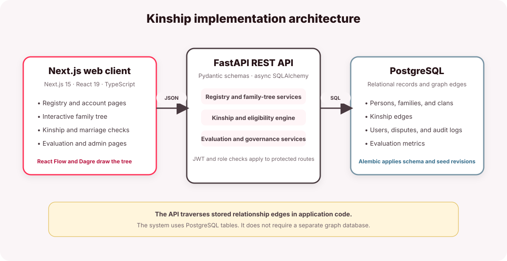
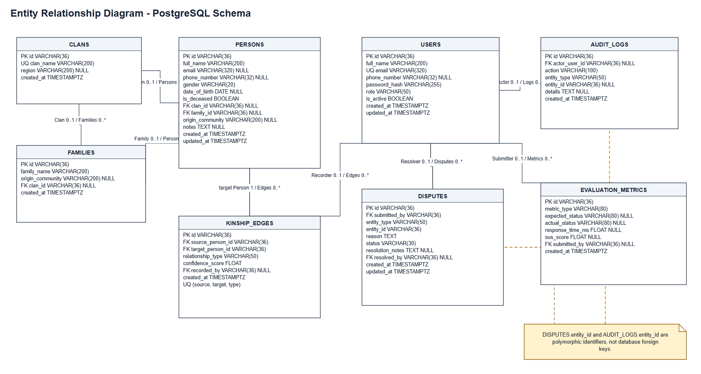
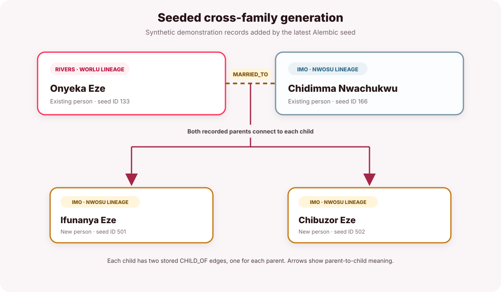
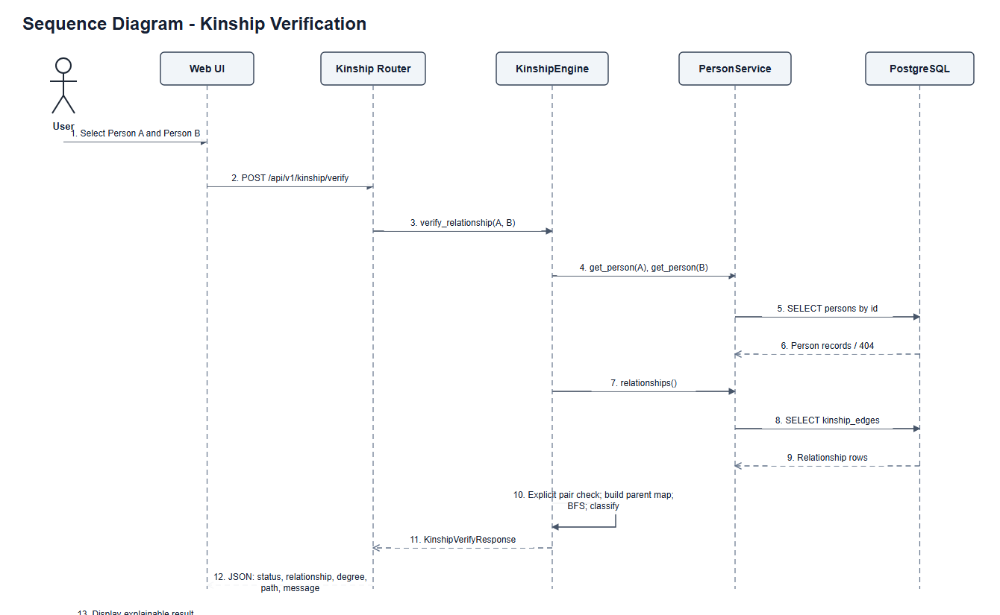
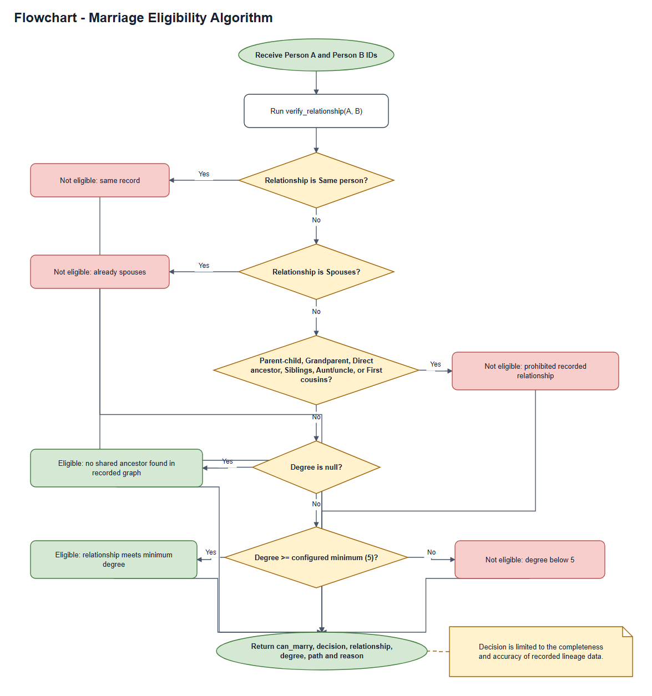

# CHAPTER FOUR

# SYSTEM IMPLEMENTATION, TESTING AND EVALUATION

## 4.1 Introduction

This chapter describes the implementation of the Kinship Verification Framework. Chapter Three presented the requirements, design, and evaluation method. This chapter describes the software environment, data model, main functions, and available test evidence.

The repository contains an implemented web application and an API test suite. It does not contain a test run report, performance report, or user acceptance report. This chapter therefore separates implemented features from results that still require measurement.

## 4.2 Implementation Environment

The application has a web client, a REST API, and a PostgreSQL database. The web client sends JSON requests to the API. The API validates requests, authorizes access where required, and reads or writes database records.

| Component | Implementation |
|---|---|
| Web client | Next.js 15, React 19, TypeScript, and Tailwind CSS 4 |
| Family tree | React Flow and Dagre |
| API | Python 3.11 or later, FastAPI, Pydantic, and SQLAlchemy 2 |
| Database | PostgreSQL with the `asyncpg` driver |
| Schema management | Alembic migrations |
| Development tools | Node.js 20 or later, pnpm 9, and uv |
| API test tools | pytest, FastAPI TestClient, and in-memory SQLite fixtures |

The repository declares these tools and versions. It does not include a report of the exact versions installed on a test machine.

The API uses `/api/v1` as its base path. FastAPI provides the interactive API page at `/docs`. The web client runs as a separate Next.js application and calls the API over HTTP.

## 4.3 System Architecture

Figure 4.1 shows the implemented components and their data flow. The API performs relationship traversal in application code. PostgreSQL stores the people and relationship edges in relational tables. The system does not require a separate graph database.



The web client contains pages for registration, the registry, the family tree, kinship verification, administration, and evaluation. Shared React components provide person selection, navigation, relationship paths, and family tree nodes.

FastAPI routes use Pydantic schemas to validate input and format responses. Dependency functions provide database sessions, identify the current user, and enforce role access. Service classes hold registry, tree, kinship, and evaluation logic.

| Layer | Main code locations | Main responsibility |
|---|---|---|
| Web pages | `apps/web/app/` | Render the home page, registry, tree, verification, administration, and evaluation views. |
| Web components | `apps/web/components/` | Provide family tree, relationship path, person selection, and navigation components. |
| API routes | `apps/api/app/api/v1/endpoints/` | Handle account, person, family, clan, kinship, dispute, administration, and evaluation requests. |
| API services | `apps/api/app/services/` | Implement registry operations, graph traversal, kinship rules, audit records, and evaluation summaries. |
| Data models and schemas | `apps/api/app/models/` and `apps/api/app/schemas/` | Define database records and validated API data. |
| Database revisions | `apps/api/alembic/versions/` | Create the schema and load versioned sample records. |

**Table 4.1: Main implementation layers.**

## 4.4 Database Implementation

Figure 4.2 shows the main database entities. The figure matches the SQLAlchemy models in the current API. It includes the person, family, clan, user, kinship edge, dispute, audit, and evaluation records.



| Entity | Stored information |
|---|---|
| `Person` | Name, contact details, gender, birth date, deceased status, family, clan, community, and notes. |
| `Family` | Family name, origin community, and optional clan. |
| `Clan` | Clan name and region. |
| `KinshipEdge` | Source person, target person, relationship type, confidence score, and recorder. |
| `User` | Account name, email, password hash, role, and active status. |
| `Dispute` | Submitted concern, affected record, status, resolution notes, and reviewer. |
| `AuditLog` | Actor, action, target record, details, and timestamp. |
| `EvaluationMetric` | Expected and actual relationship status, response time, SUS score, and submitter. |

**Table 4.2: Main database entities.**

The `kinship_edges` table stores relationships between two people. A unique constraint prevents duplicate rows with the same source, target, and relationship type. A `CHILD_OF` edge points from a child to a parent. The engine also accepts `PARENT_OF` edges and uses both types when it builds its parent map.

Alembic applies the schema and sample data. The migrations create sample records for the Rivers, Imo, and Anambra lineages. The latest seed migration adds a synthetic marriage between an existing Rivers person and an existing Imo person. It also adds two children to the Imo family and records both parents for each child.

Figure 4.3 shows the records added by that migration. It uses the people and edge IDs in `202609270001_seed_cross_family_generation.py`. The arrows show parent-to-child meaning. The database stores each parent link as a `CHILD_OF` edge from the child to the parent.



## 4.5 Implementation of Core Functions

### 4.5.1 Account and Role Management

The registration route creates an account and stores a PBKDF2-SHA256 password hash. The login route compares the submitted password with its stored hash and requires an active account. A successful login returns a signed JWT access token. The default token expiry is 60 minutes.

The configured bootstrap email receives the `Admin` role during registration. Other new accounts receive the `User` role. Admins can manage users, disputes, and audit records. Registrars can manage families and clans and can create people and links. Elders can create people and links. Users can use the public views, submit record concerns, and submit SUS responses.

Role-based access protects write and administration routes. Several read routes do not require a token. These include person search, person details, family and clan lists, family trees, and kinship verification requests. The API can therefore return personal record data to unauthenticated callers. This access rule is a privacy limitation for real lineage data.

### 4.5.2 Person and Lineage Records

The registry stores people, families, clans, and relationship edges. A person can have a family, a clan, an origin community, and notes. The current model does not implement the full State-to-LGA-to-town-to-kindred hierarchy described in Chapter Three.

Authorised users can create people and record parent or spouse links. The API records each link with the user who submitted it. The database keeps these links separate from the person record, so one person can connect to several people across family assignments.

### 4.5.3 Interactive Family Tree

The family tree route starts with all people assigned to the selected family. It follows recorded relationship edges to find connected people, including people assigned to other families. Each returned node includes its family name and a marker for the selected family.

The web client uses Dagre to position the parent-child structure. React Flow draws the people and relationship edges. The interface gives parent, spouse, sibling, and other links different styles. A user can select a person to highlight that person's direct recorded links.

The tree includes connected records. It does not prove biological relationships. A missing or incorrect edge can change which people appear in the tree.

### 4.5.4 Kinship Verification

The kinship route accepts two person IDs and returns a relationship result. Figure 4.4 shows the request flow through the web client, API route, engine, person service, and database.



The engine loads both person records and looks for a direct spouse or sibling edge. If it finds no such edge, it builds a parent map from `CHILD_OF` and `PARENT_OF` records. It searches upward from both people with breadth-first search.

If one person is an ancestor of the other, the engine returns a direct ancestor label and the recorded path. If both people share an ancestor, the engine selects the shared ancestor with the smallest combined distance. It then calculates the degree and classifies the relationship.

For a shared ancestor, the engine calculates degree as the combined parent-link distance minus one. It uses a minimum value of one for sibling paths. Parent and child, siblings, grandparent and grandchild, aunt or uncle and niece or nephew, first cousins, and second cousins receive defined labels. The default relatedness threshold is degree 2. The application can change this value through configuration.

The response includes the relationship, degree, common ancestor, named people along the selected path, link direction, and an explanation. If the recorded graph has no shared ancestor, the response says that the data contains no shared ancestor. It also states that missing lineage can hide a relationship.

### 4.5.5 Marriage Eligibility

The marriage endpoint runs the kinship engine and applies the configured screening rule. The default minimum degree is 5. The rule blocks the same person, spouses, parent-child relationships, grandparent-grandchild relationships, direct ancestors, siblings, aunt or uncle relationships, and first cousins.

A pair with no shared ancestor currently passes the minimum-degree rule. This result depends on the completeness of the recorded lineage. A spouse edge means that the records already mark the pair as spouses. It does not establish a blood relationship.

Figure 4.5 shows the screening branches in the current implementation. The value 5 is the configured default. An environment setting can change it.



The endpoint returns an eligibility decision, relationship, degree, path, and explanation. The result is a screening aid. It is not a legal, medical, religious, or cultural ruling.

### 4.5.6 Disputes, Audit Records, and Evaluation

Users can submit a dispute about a family record. An administrator can resolve the dispute and add resolution notes. The API records administrative actions in the audit log.

The evaluation API provides relationship accuracy, response-time, and SUS summary routes. The SUS route accepts ten answers on a one-to-five scale and stores the calculated score. The other two summary routes read metric rows from the database.

The current request handlers do not create relationship-accuracy or response-time metric rows. The repository's load-test script is a placeholder. The summary routes cannot provide measured accuracy or performance results until another process adds the required records.

## 4.6 Testing

The repository defines 17 API test functions in five test files. Table 4.3 lists their scope. These entries describe test cases in source code. They do not report pass or fail results.

| Test file | Defined cases | Coverage |
|---|---:|---|
| `test_kinship_engine.py` | 4 | Shared ancestor, direct parent-child, no shared ancestor, and marriage threshold cases. |
| `test_person_endpoints.py` | 3 | Person creation and search, parent link creation, and unauthenticated write rejection. |
| `test_family_endpoints.py` | 2 | Family and clan lists, selected-family tree response, and missing-family response. |
| `test_admin_endpoints.py` | 3 | User and audit management, role restrictions, and dispute resolution. |
| `test_evaluation.py` | 5 | Health, evaluation summaries, SUS scoring and validation, and account registration and login. |
| **Total** | **17** | **API test cases defined in the repository.** |

**Table 4.3: API test inventory.**

The test fixture creates an in-memory SQLite database for each test. It creates tables from the SQLAlchemy models and uses FastAPI TestClient to call the API. The fixture does not apply the Alembic migrations. These tests cover API behavior with SQLite. They do not exercise PostgreSQL-specific behavior or the deployed database.

The repository does not include a test execution report. Therefore, this chapter does not state a pass rate. The test suite also does not directly cover cross-family tree expansion, every intermediate relationship-path label, browser behavior, or concurrent load.

The project provides this API test command for local use:

```sh
cd apps/api
uv run pytest
```

The web scripts provide TypeScript type analysis and a production build. They do not provide a browser-level test suite.

## 4.7 Evaluation

Chapter Three uses the Information Systems Success Model. It considers system quality, information quality, and user satisfaction. Table 4.4 applies these dimensions to evidence available in the repository.

| Dimension | Available implementation evidence | Evaluation status |
|---|---|---|
| System quality | API routes, role-based access, kinship services, and source-defined tests. | Test outcomes, response times, uptime, and concurrent capacity are not reported. |
| Information quality | Person, family, clan, and relationship records, plus seeded sample lineages. | The repository contains no measured study of accuracy or completeness. Results depend on recorded data. |
| User satisfaction | The application can collect ten-item SUS responses. | The repository contains no SUS result set or task-based user acceptance report. |

**Table 4.4: Evaluation evidence by success dimension.**

The accuracy summary compares expected and actual relationship statuses only when evaluation rows exist. The service returns zero accuracy when the database contains no such rows. This value means that the database has no recorded cases. It is not a measured accuracy result.

The performance summary calculates average and maximum response times from stored metric rows. No current request handler writes these rows. The file `apps/api/scripts/load_test.py` contains a placeholder message. The repository provides no measurements for Chapter Three's response-time and concurrent-user targets.

The SUS endpoint implements score calculation and interpretation. The repository contains no post-implementation SUS responses. The questionnaire results in Chapter Three describe requirements and views about the proposed system. They do not measure task completion or satisfaction after participants used this implementation. Chapter Three's planned user acceptance test therefore has no reported result in the available files.

## 4.8 Discussion and Limitations

The implementation stores relationships as relational edges and performs graph traversal in the API. This design supports connected family trees without a separate graph database. The migration chain also provides sample lineages and a cross-family connection for demonstration.

The kinship engine evaluates recorded parent links. It does not use DNA data or prove biological relationships. The marriage rule uses configurable project thresholds. Communities must review those rules before they use the result for decisions.

Several requirements from Chapter Three remain unverified or absent. The repository does not demonstrate offline use, multi-factor authentication, automatic backups, 99.5 percent uptime, or support for 10,000 concurrent users. It does not include a full location hierarchy. The API's unauthenticated read routes also expose personal record fields. These limits affect privacy, information quality, and readiness for real community data.

The current test suite focuses on API behavior with SQLite. It needs a recorded execution report and tests against PostgreSQL migrations. It also needs direct tests for cross-family expansion and relationship-path output. The project needs a browser-based user study and a measured load test before it can report usability or performance results.

## 4.9 Chapter Summary

This chapter described the current web, API, and database implementation. It explained account access, lineage records, cross-family tree expansion, kinship verification, and marriage screening. It also reviewed the database figures and the seeded cross-family generation.

The repository defines 17 API test functions, but it contains no execution report. It also contains no measured performance report or user acceptance results. The current evidence supports a description of implemented features and test coverage. It does not support claims about test success, user satisfaction, data accuracy, uptime, or production capacity.
