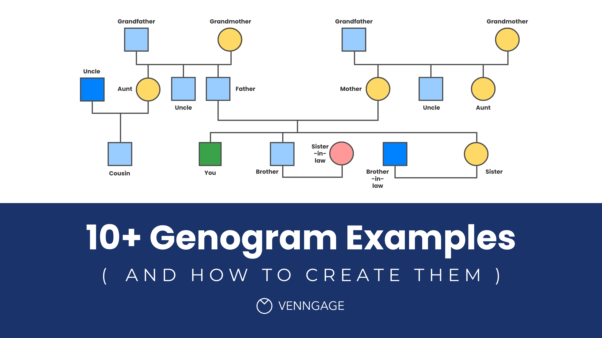
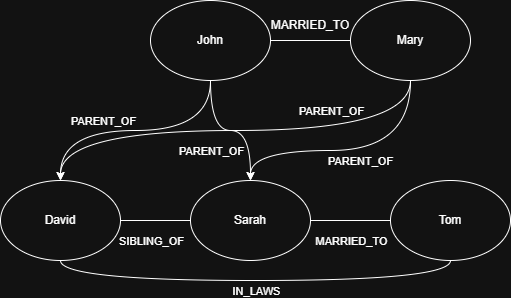
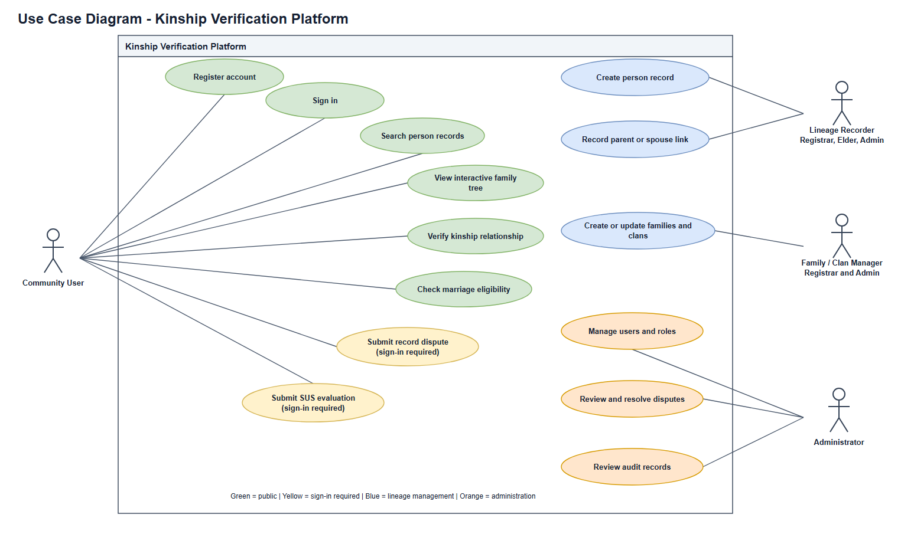
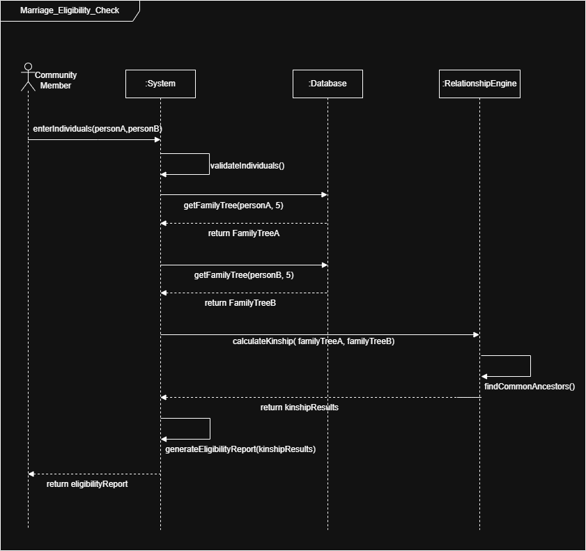

# A GRAPH-BASED KINSHIP VERIFICATION SYSTEM FOR ANCESTRY TRACING AND MARRIAGE ELIGIBILITY ASSESSMENT IN AFRICAN COMMUNITIES

**BY**

**IKEH-EZEJI CHINAZA PAMELA**  
**20211258792**

A project presented to the Department of Software Engineering, School of Information and Communication Technology, Federal University of Technology, Owerri, in partial fulfilment for the award of Bachelor of Technology (B. Tech) in Software Engineering.

**June 2026**

---

## CERTIFICATION

I certify that this research “A Graph-Based Kinship Verification System for Ancestry Tracing and Marriage Eligibility Assessment in African Communities” was carried out by Ikeh-Ezeji Chinaza Pamela (20211258792) in partial fulfilment for the award of the degree of B-Tech in Software Engineering, of the Federal University of Technology, Owerri.

| Name/Role | Date |
|---|---|
| Engr. Dr. A. I. Erike (Project Supervisor) | |
| Dr. C.O. Ikerionwu (HOD, SOE) | |
| Prof. U. F. Eze. (Dean, SICT) | |
| External Examiner | |

## DEDICATION

I dedicate this work to God Almighty; with him all things are possible.

To my parents, for the support, love, encouragement and advice.

## AKNOWLEDGEMENT

First and foremost, all my praise and gratitude go to God almighty, for the strength, health, and grace to carry out this project.

I wish to express my profound appreciation to my supervisor, Engr. Dr. A. I. Erike, for his time, patience, constructive criticism and guidance during this research. His immediate and insightful feedback was instrumental in shaping this work.

My sincere gratitude also goes to the Head of Department, Dr. C. O. Ikerionwu, and all the esteemed lecturers of the Department of Software Engineering for the solid academic foundation they have instilled in me for the past 5 years, especially Engr. Mrs. Elei Florence, my Course Adviser, for her support and guidance.

To my parents, Engr. Iyke Reginald and Mrs. Chika Ezeji, Thank you. For your unwavering support, unending prayers, constant words of encouragement, and endless love. Thank you for everything. To my brothers; Iycee, Splosh and BomBom, thank you for the moral support.

To my friends and colleagues, and to everyone who contributed directly or indirectly to this work, I am grateful.

Thank you all.

## ABSTRACT

*(To be written after the work is completed)*

## TABLE OF CONTENTS

- [Chapter One: Introduction](#chapter-one-introduction)
  - [1.1 Background to the Study](#11-background-to-the-study)
  - [1.2 Problem Statement](#12-problem-statement)
  - [1.3 Aim](#13-aim)
  - [1.4 Objectives](#14-objectives)
  - [1.5 Research Questions](#15-research-questions)
  - [1.6 Scope of the Study](#16-scope-of-the-study)
  - [1.7 Significance of the Study](#17-significance-of-the-study)
  - [1.8 Definition of Terms](#18-definition-of-terms)
- [Chapter Two: Literature Review](#chapter-two-literature-review)
  - [2.1 Foundational Concepts](#21-foundational-concepts)
  - [2.2 Theoretical Framework](#22-theoretical-framework)
  - [2.3 Related Works](#23-related-works)
- [Chapter Three: Methodology](#chapter-three-methodology)
  - [3.1 Requirements Gathering and Data Collection](#31-requirements-gathering-and-data-collection)
  - [3.2 System Design Methodology](#32-system-design-methodology)
  - [3.3 Testing and Evaluation Methodology](#33-testing-and-evaluation-methodology)
- [Reference List](#reference-list)

---

## CHAPTER ONE: INTRODUCTION

### 1.1 Background to the Study

Genealogy and kinship verification have always been more than just family trees in African societies; they’ve been the very foundation of how communities organise themselves. Across many communities, family lineage wasn’t simply recorded, it was lived. It was passed down through oral traditions by historians and elders in the community. For a very long time, African communities have relied on oral genealogies passed down from generation to generation by designated tribal historians and elders in the community. This ensures that cultural identity didn’t fade and that social structures remained intact (Bush & Lynch, 2019). These oral traditions served as both historical records and living documents that governed social relationships, marriage eligibility and communal identity.

Genealogy is more than just knowing your family history, it has real-life effects, especially when it comes to marriage. For generations, knowledge of familial relationships has guided marriage eligibility choices. This practice has prevented unions between individuals with close blood ties. In doing so, it has preserved the genetic health and social harmony of communities. The continuity of consanguineous marriages, that is, marriages between individuals who are related either as second cousins or closer, remain surprisingly common worldwide. Estimates indicate that more than 1.2 billion people around the world practice consanguineous marriages (Fareed & Afzal, 2017). In Africa, the consanguinity rates vary considerably. In Egypt, for instance, a prevalence of 35.9% among women who had entered marriages (Hussein et al., 2022), and a Moroccan study documented a frequency of 43.2% among respondents (El Goundali et al., 2022). These findings are not just statistics; they highlight the persistent cultural significance of kinship awareness in marriage decisions across African communities.

However, in modern times, African communities face significant challenges to traditional genealogy systems. Urbanization, migration, and displacement have fragmented family units. While the loss of oral history increases as the older generations pass without transmitting their knowledge to the younger generation. Recognizing the urgency of this problem, FamilySearch began efforts to record oral family histories in Ghana in 2004 (*FamilySearch*, 2026). Research by Bush & Lynch, (2019) wrote about the weight of this preservation crisis. They stated that oral genealogies are at risk from war, deterioration, and competing for space in overcrowded archives. Today, FamilySearch provides financial support for over 5,000 African contract interviewers across 15 countries, including Nigeria, Ghana, Kenya, and Uganda, conducting more than 500,000 interviews and preserving over 190 million records (Bush & Lynch, 2019). By 2018, the organisation had collected over 16 million names across Africa, with the largest collections in Ghana (6.4 million), Nigeria (4 million), and Kenya (3.6 million) (Bush & Lynch, 2019).

The problems faced in traditional genealogy systems have serious implications for marriage practices. Research has shown that consanguinity can increase being prone to a range of chronic and complex diseases, including cancers, diabetes, cardiovascular diseases, and chronic respiratory diseases (El Goundali et al., 2022). Studies have further shown that consanguinity is associated with adverse reproductive outcomes including spontaneous abortions and stillbirth (Hussein et al., 2022). In the modern African society, which is characterized by geographical mobility and fractured family units, the traditional manual genealogy systems, which mostly rely on memory and oral transmission, is now largely inadequate for addressing these challenges.

Recent technological growth offers new opportunities to address these challenges. Graph databases have demonstrated significant potential for modelling elaborate relationship structures. Dirgahayu, (2024) presented a pattern-based method for creating a graph schema of genealogy enhanced for implementation in graph databases, identifying the family as the foundational pattern for schema development. Wang et al., (2024) took a broader approach, creating an integrated framework for knowledge inference and visualization using a knowledge graph for genealogy data, showing that genealogical information can be effectively broken down, then rearranged in order to visualize it properly. Yar & Tun, (2016) proposed a framework for exploring people’s relationships using graph databases, where individuals are represented as nodes with their attributes as properties, with algorithms built to look for connections between them.

But here's the catch: most of these platforms weren't built with African communities in mind. They're designed for Western populations and lack the culturally contextualised kinship verification mechanisms that African families actually need. Organisations like FamilySearch have done commendable work recording oral genealogies across the continent, but their focus has largely remained on preservation, not on building a systematic verification framework (Bush & Lynch, 2019; adedayoolumide, 2021). And while researchers have put significant effort in biometric kinship verification using facial recognition and computer vision (Qin et al., 2020; Wu et al., 2022), no much attention has been given to developing genealogical data-based verification systems for African contexts. That gap between what technology can do and what communities actually need is exactly what this study sets out to fill.

### 1.2 Problem Statement

A lot of African societies depend on elders and oral traditions to confirm family relationships before marriage, but what happens when the elders are no longer there to pass this knowledge on? That’s the reality of many communities today. Migration, urbanization and poor record-keeping have made these traditional ways difficult to sustain (Bush & Lynch, 2019). Families are now scattered across cities, countries, and even continents. The result? People may enter marriages with close relatives without being aware, this leads to cultural, social and genetic consequences (Fareed & Afzal, 2017; Hussein et al., 2022). Research shows a large number of consanguineous marriages in African communities and studies indicates a significant continuity in various regions (El Goundali et al., 2022; Hussein et al., 2022). Now, it's true that researchers have poured significant effort into biometric kinship verification using facial recognition and computer vision(Qin et al., 2020; Wu et al., 2022), but the problem is that there is no sustainable technology currently for systematically storing lineage information and verifying familial relationships within African communities using genealogical data. This gap leaves societies without accessible tools to address the growing problem of consanguineous marriages in African communities.

### 1.3 Aim

The aim of this research is to design, develop, and evaluate a Graph-Based Kinship Verification System for Ancestry Tracing and Marriage Eligibility Assessment in African Communities.

### 1.4 Objectives

The objectives of this research are:

1.  To analyse the existing methods of genealogy and kinship verification in order to identify their strengths and limitation in the African context.

2.  To design a graph-based kinship data model that shows the complex family structures of African communities.

3.  To develop a web-based ancestry registration and lineage management platform.

4.  To develop a kinship verification algorithm that can automatically detect familial relationships and assessing consanguinity risks.

5.  To evaluate the effectiveness and usability of the proposed platform through testing and user feedback.

### 1.5 Research Questions

This research addresses the following questions:

1.  How can lineage records be digitally represented in a way that shows the complexities of African family structures?

2.  How can kinship be automatically detected from genealogical data using graph-based algorithms?

3.  What level of relationship should trigger marriage warnings in the African socio-cultural context?

4.  How usable and effective is the proposed platform in supporting lineage management and kinship verification?

### 1.6 Scope of the Study

This study focuses on the design and evaluation of a kinship verification framework. The scope includes family registration, family tree generation, relationship verification, marriage eligibility checking, and lineage visualization. The following areas are excluded from the study: DNA testing and genetic analysis, medical diagnosis of genetic conditions, and government identity management systems. The focus is on genealogical relationship verification rather than biometric or genetic kinship detection.

### 1.7 Significance of the Study

This study holds significance for multiple stakeholders. Families gain a reliable mechanism for tracing lineage and assessing marriage eligibility. Traditional institutions gain a tool for preserving and transferring genealogical knowledge across generations. Marriage counsellors and religious bodies can use the system to provide informed guidance to families. Researchers get insights into the application of graph databases and algorithms in culturally specific situations. Cultural heritage organisations benefit from an organised framework for preserving oral genealogies. Ultimately, this platform contributes to the protection of African cultural heritage while addressing the current problems of consanguineous marriage in mobile, urbanized populations.

### 1.8 Definition of Terms

Consanguineous marriage: A union between individuals who are second cousins or closer, sharing a common ancestor within the previous four generations.

Genealogy: The systematic study and documentation of family lineages, ancestry, and descent relationships.

Graph Database: A database management system that uses graph structures with nodes, edges, and properties to represent and store data, enabling efficient relationship querying.

Kinship Verification: The process of identifying whether two individuals share a biological or genealogical relationship.

Lineage Tracing: The identification of ancestral connections between individuals across generations.

Oral Genealogy: A spoken lineage tradition common in parts of the world, especially in localities where few written records exist, serving as the main genealogical tool for researchers and communities.

## CHAPTER TWO: LITERATURE REVIEW

This chapter establishes the necessary background for a clear understanding of both the research problem and the proposed solution. It begins by defining and explaining the main concepts at the heart of this investigation, namely, genealogy, kinship, consanguinity, and kinship verification. Next, it examines the theoretical foundations, tracing the development of ideas from older kinship theories to modern graph-based data models that shape the current approach. The chapter closes with a review of past research, bringing together what previous studies have achieved while pointing out the remaining gaps that this study intends to fill.

### 2.1 Foundational Concepts

This section deals with foundational concepts that are associated with kingship verification.

#### 2.1.1 Genealogy
Genealogy, at its simplest, is the study of family history and lineage. It involves tracing the lineage of individuals, charting their ancestors and descendants to construct a comprehensive narrative of familial history (Dirgahayu, 2024) . In African context, it is not just a record of names and dates, it is a living map of social relationships, responsibilities, and identities. As Bush & Lynch, (2019) point out, oral genealogies in African communities function as “living documents" that shape everything from marriage eligibility to political alliances.

Genealogy systems can be broadly classified as manual and digital approaches (Xue, 2026). Traditional genealogy systems rely on memory, oral transmission, and physical records, while digital systems use databases and software to store, arrange and visualize family relationships. Modern digital tools like RootsMagic and Family Tree Maker have made genealogy easier. They allow users build trees, document DNA, and generate charts; all in one place (Eberhard, 2025). That is a significant progress in the body of knowledge. However, these platforms were not built for African communities. They don’t capture the complexity of extended family structures, and they don’t offer culturally relevant kinship verification.

#### 2.1.2 Kinship
Kinship refers to the web of relationships that connect individuals through blood, marriage or adoption. In many African societies, kinship systems are complex and multi-layered, this means that they don’t always follow the simple nuclear family model common in the Western contexts. Extended families, clan structures, and lineage groups often overlap in ways that make kinship verification challenging, especially in communities that have become geographically dispersed.

Kinship verification is the act of determining whether two or more persons are biologically related, giving more information on genetic trait inheritance and other applications (Maheshwari et al., 2025).

The term kinship covers a lot of ground; it can be categorized into several types:

*Consanguinity* refers to relationships by blood or shared ancestry. Fareed & Afzal, (2017) explain that consanguineous unions increase the likelihood of autosomal recessive disorders, which is why they have become a major concern in clinical genetics. However, consanguinity is not a one-size-fits-all concept. Its prevalence and the degree of inbreeding vary widely across populations, shaped by ethnicity, religion, culture, and geography (Fareed & Afzal, 2017).

*Affinity*, on the other hand, is about marriage ties, the relationship we gain through our spouses and their families. Then there are *clan relationships*, which bind individuals to larger kinship groups tracing descent from a common ancestor. In many African communities, these clans form the backbone of social organisation. And of course, we cannot forget extended family; the network of grandparents, aunts, uncles, and cousins that extends far beyond the nuclear family model common in the West.

Why does all this matter for the study? Because marriage decisions in many African societies depend on understanding where someone fits within this web of relationships. The degree of relatedness between potential spouses is not just a matter of social etiquette—it has real implications for genetic health, family harmony, and community stability. So, before we can build a platform that verifies kinship, we need to be clear about what kinds of kinship we are talking about.

#### 2.1.3 Consanguineous marriages
A consanguineous marriage is a marriage between individuals who share a common ancestor. The definition varies across contexts, but researchers commonly use “second cousins or closer” as the threshold (Fareed & Afzal, 2017). The reasons for such marriages are deeply cultural. For many families, consanguineous unions help preserve property, simplify marital arrangements, and maintain family structure. There is also a perception, that these marriages are more stable (Popescu et al., 2025).

Popescu et al., (2025) point out that while security and stability are often cited as motivations for consanguineous marriage, women in these unions frequently experience physical and verbal abuse. That notwithstanding, divorce rates remain low. This is because the blood bond creates a powerful social pressure to stay together; splitting up would disrupt the entire family system. This is especially true in poorer rural communities, where illiteracy rates are higher and medical knowledge about the risks of consanguinity is limited. But it leads to medical emergencies like increase in the rates of abortions, infant deaths, and children born with congenital defects (Popescu et al., 2025).

#### 2.1.4 Family Trees
At its simplest, a family tree is a visual map of who belongs to whom. It is a diagram of ancestors, descendants, and the connections between them. Traditionally, these are drawn as branching charts, with boxes for individuals and lines for relationships like parent-child, spouse, or sibling, an example is shown in figure 2.1. For researchers, family trees are the starting point. They can be as simple as a few generations or as complex as sprawling networks spanning centuries. Modern software like RootsMagic has made this easier, allowing researchers to attach sources, photos, and even DNA data to their trees (Eberhard, 2025). These traditional tree structures have a blind spot, they struggle to capture the reality of communities where intermarriage and endogamy are common, where family lines loop back on themselves in ways that a simple branching diagram just cannot handle (Stumpf & Wilson, 2022).

*Figure 2.1. A family tree example (Ivonna Cabrera, 2026)*

#### 2.1.5 Graph-Based Relationship Networks
Traditional family tree models, while useful, present significant constraints in representing complex kinship structures. Graph-based relationship networks address these shortcomings by enabling more flexible and comprehensive representations of genealogical connections. Instead of a rigid branching structure, graphs treat family relationships as a flexible web. Individuals become nodes, and relationships like PARENT_OF, MARRIED_TO, or SIBLING_OF become the edges that connect them (Dirgahayu, 2024). An example of a graph-based network is shown in figure 2.2.

*Figure 2.2 Graph-based network example*

### 2.2 Theoretical Framework

This study draws on three theories, each addressing a different piece of the puzzle. Social Network Theory (SNT) helps us understand how family relationships function as interconnected webs. Graph Theory (GT) gives us the mathematical tools to model those webs in a computer system. And the Information Systems Success Model (ISSM) provides a way to evaluate whether what we build actually works. The sections following explain these theories further.

#### 2.2.1 Social Network Theory (SNT): Seeing Families as Webs, Not Chains
At its core, this theory says that human relationships are not just a series of isolated pairs, they form networks. Individuals are nodes, and their connections, whether biological, marital, or social are the ties that bind them together. This might sound obvious, but it is actually a significant shift from how genealogy has traditionally been viewed. Old-school family trees treat relationships as hierarchical branches: you have parents, grandparents, great-grandparents, and so on. But that is not how families actually work in practice, especially in the African contexts. Families’ lineage lines are messy. They loop back on themselves through intermarriage. They stretch sideways through extended kinship networks. They include people who are not blood relatives but are just as important to the family structure. The SNT gives permission and the conceptual tools to model family relationships as the complex webs they really are. Instead of forcing African family structures into a neat Western-style tree, we can represent them as networks.

#### 2.2.2 Graph Theory: The Mathematical Backbone
If Social Network Theory provides the conceptual framework, Graph Theory provides the mathematical one. This is the most directly relevant foundation for this research because it tells us how to actually build a system that can store, query, and analyse family relationships.

This theory treats individuals as nodes (or vertices), and relationships become edges connecting them (Dirgahayu, 2024). A parent-child relationship becomes an edge. A marriage becomes an edge. A sibling relationship becomes an edge. Once this structure is in place, one can start querying the system with questions like: How are these two people related? What's the shortest path between them? Who are all the descendants of a particular ancestor? These are exactly the kind of queries a kinship verification platform needs to answer.

Dirgahayu, (2024) demonstrated how this works in practice, showing that graph databases can effectively model family trees. But it's worth noting that the schema, that is, how you structure the nodes and edges matters enormously. A poorly designed schema leads to messy data, slow queries, and unreliable results. This is why this study pays careful attention to schema design, building on Dirgahayu's work while adapting it for the specific needs of African kinship systems.

#### 2.2.3 Information Systems Success Model: Does It Actually Work?
The information Systems Success Model is used to evaluate how accurately the system has been able to perform in delivering its intended value. The model breaks system success down into several dimensions as follows: *System quality* looks at the technical side of the system design: It answers questions like, Is the platform usable? Does it perform well? Does it do what it's supposed to do? *Information quality* on the other hand asks about the data itself: Is it accurate? Is it complete? Is it relevant to what users actually need? And finally, there is the *user satisfaction* component that targets the human element: who are the people using the platform? Do families, traditional institutions, marriage counsellors actually find it helpful?

For this study, these dimensions are not just abstract categories. They translate into specific evaluation criteria. Can users easily register their family members? Can they generate accurate family trees? Can they verify kinship relationships reliably? Can they assess consanguinity risks? And most importantly, do they trust the system enough to actually use it?

In summary, the Social Network Theory provides the *what* - it tells us that family relationships are networks, not hierarchies. Graph Theory provides the *how* - it gives us the tools to model those networks computationally. And the Information Systems Success Model provides the *so what* - it tells us whether our computational model actually meets users' needs. Together, they form a coherent theoretical foundation that guides everything from system design to evaluation.

### 2.3 Related Works

Recent research has shown that graph-based approaches work well for genealogy and kinship verification. Several studies have built and tested systems that use graphs to model family relationships. This section reviews key empirical studies that demonstrate practical applications of graph-based genealogy systems.

Dirgahayu, (2024) took this idea further by developing a pattern-based method for building genealogy schemas specifically for graph databases. The core focus here is that the family unit itself becomes the foundational building block. From there, the researcher identified four variations: complete families, couples without children, children without identified parents, and children with only one parent. To test whether this schema actually worked, he ran a series of queries, retrieving descendants, ancestors, and siblings, and found that it held up well. The results of the study shows that the graph databases can actually streamline genealogical research in practice, not just in theory.

Stumpf & Wilson, (2022) applied this same logic to a more specific problem: detecting inbreeding in family trees. Their approach is powerful because it traces every path to every shared ancestor, essentially mapping the full web of relationships between cousins. Traditional trees sometimes miss these connections, but graphs can surface them instantly.

Wang et al., (2024) took a broader view, building an integrated knowledge graph framework for genealogy data. Their framework operates across five layers—target, resource, data, inference, and application, and they tested it using the "Manchu Clan Genealogy" as a case study. Results show that the framework could break down genealogical information, reconstruct it, and visualise it in ways that highlight the intricate relationships between people, places, and time. In other words, it didn't just store data, it helped people to actually see and understand the connections.

Borges, (2022) developed VisAC, an interactive tool designed to support visual analysis of consanguinity in family ancestry. The tool uses the inbreeding coefficient as a measure of consanguinity. This represents the probability that two alleles in the DNA came from the same ancestor. What makes VisAC useful is its dual visualization approach. It provides both a single-root view for an individual's pedigree and a two-roots view for analysing co-ancestry between two people. Borges validated this approach through questionnaires and user testing. The study showed that visualizing common ancestors helps users identify inbreeding patterns that might otherwise go unnoticed.

Vigeland, (2022) introduced QuickPed, a web application for interactive pedigree creation and analysis. The tool supports complex inbreeding scenarios and includes a library of common pedigrees. Most importantly, Vigeland developed a new algorithm that describes pairwise relationships in words. It translates complex path calculations into simple language like "first cousins once removed." This feature is useful for kinship verification systems intended for community use. It takes technical relationship calculations and presents them in language that families and traditional leaders can easily understand. The application also calculates standard coefficients of relatedness, including inbreeding, kinship, and identity coefficients.

Othram Research Team demonstrated how graph-based genealogy works in forensic contexts (Newman et al., 2026). They converted GEDCOM files into graph structures where each person becomes a node and each relationship becomes a connection. This approach enables capabilities that are difficult to achieve with traditional tree structures. Users can traverse relationships in any direction, detect duplicate ancestors, identify inconsistencies, and model non-linear structures like pedigree collapse. The study showed that graph representations can handle the complexity of real-world family structures. This includes adoptions, remarriages, and multiple partnerships. This flexibility is essential for the African context where family structures often include extended kinship networks, multiple marriages, and intricate clan relationships.

Pedersen et al., (2025) presented a graph-based approach to identify family members of any degree of relatedness. This addresses a fundamental challenge in genealogy research. Their R package, LTFHPlus, efficiently identifies family members beyond first-degree relatives. This process can be tedious and error-prone when done manually. The package can attach relevant information to each individual, calculate kinship matrices for identified family members, and convert family members from a graph back into trio information. The significance of this work is the scale at which it operates. The approach can handle large datasets and complex family structures, making it suitable for population-level genealogical analysis. This scalability is directly relevant to the proposed kinship verification framework, which must accommodate growing datasets as more families register their lineage information.

Pessl et al., (2024) extended genealogical visualization by adding geospatial information to graph-based family representations. Their GeoTAM approach combines three data dimensions: relational (family connections), temporal (timeline of events), and geospatial (birthplaces, migration patterns). The visualization uses area circles to represent geographic locations at different levels—country, city, or street. These circles act as containers that hold all nodes linked to that location. This approach addresses a key weakness of traditional pedigree charts. These charts focus only on generation order and ignore the spatial side of family history. For African communities, where migration and displacement are significant challenges, this ability could provide valuable context for understanding kinship connections and finding gaps in genealogical records.

Nobre et al., (2019) introduced Lineage, a visual analysis tool for studying multifactorial diseases using genealogies and clinical data. The tool uses data-driven aggregation methods to scale to multiple families. This addresses the challenge of visualizing large, complex genealogy graphs. The researchers showed that aggregation techniques can effectively compress large family trees while preserving essential relationship information. This allows users to explore hundreds of individuals without overwhelming visual complexity. This contribution is relevant to the proposed framework's scalability requirements. It demonstrates that graph-based genealogy systems can handle large datasets while remaining usable.

The ChineseFirPedV development team built a web-based pedigree and kinship visualization system for tree breeding applications (Meng et al., 2026). The system uses Python with NetworkX for constructing pedigree graphs and Pyvis for dynamic visualization. It combines traditional pedigree records and SNP genotyping data to generate network-based genealogical diagrams and kinship cluster maps. The system offers interactive tools for exploring kinship networks, customizing node attributes, and designing mating strategies. Importantly, the system supports kinship verification, pedigree reconstruction, and detection of anomalies in recorded lineage. Its modular design allows for scalability and adaptation to other contexts. This shows that graph-based approaches can be transferred across different application domains.

These graph-based approaches offer exactly the kind of flexibility needed in the African context. African family structures are often complex, with intermarriage, polygamy, and extended kinship networks that do not fit neatly into a simple branching tree. Graphs, by contrast, can handle that complexity. They can trace relationships across multiple paths, detect consanguinity, and visualise connections in ways that traditional family trees simply cannot. The empirical evidence from these studies demonstrates that graph-based genealogy systems have been successfully built and validated across multiple domains. These include forensic genetics, clinical research, and agricultural breeding. The common thread across these studies is that graph structures provide a more accurate representation of real-world family relationships than traditional tree-based approaches. This enables more precise kinship verification and more intuitive visualization of complex genealogical connections.

Researchers have made effort to provide a fitting solution to kingship verification and ancestry tracing. For example, MyHeritage offers Smart Matches that connect your tree to others, with access to global historical records, and even photo enhancement tools (Eberhard, 2025). Findmypast, meanwhile, has carved out a niche with its British and Irish records, including exclusive collections from national archives and the world's largest online newspaper archive (Eberhard, 2025). And then there's FamilySearch, a non-profit that has taken a very different approach. Instead of focusing on commercial growth, FamilySearch has prioritised preservation and accessibility. Since 2004, they have been actively recording oral genealogies in Africa, funding over 5,000 contract interviewers across 15 countries (Bush & Lynch, 2019; *FamilySearch*, 2026).

Among the available products are Desktop software like RootsMagic and Family Tree Maker. These platforms give researchers powerful offline tools for building trees, documenting DNA, and generating charts. They are great for organising records, media, and genetic clues all in one place (Eberhard, 2025).

However, despite these advances, none of the reviewed studies specifically addresses the African socio-cultural context. Oral traditions, clan structures, and unique kinship terminologies present distinct challenges and opportunities for genealogical research in Africa. Existing tools are primarily designed for Western genealogical practices. They do not account for the complexities of African family structures or the cultural significance of kinship verification for marriage eligibility assessment. Hence, the need for adopting a graph-based approach for the study, one that is culturally contextualized and designed specifically to address the needs of African communities in preserving lineage information and verifying kinship relationships for marriage decisions.

#### Research gaps

1.  No study combines genealogy management, graph-based relationship computation, and marriage eligibility verification within an African socio-cultural context. Each of these elements exists in isolation, has not been integrated into a single, coherent framework specifically designed for African communities.

Hence, this seeks to integrate this into a simple framework for accessing marriage eligibility.

## CHAPTER THREE: METHODOLOGY

This chapter presents the methodology adopted for the research. The methodology is organized into three phases: requirement gathering, system design, and testing. Each phase is discussed in detail, including the methods used, justification for their selection, and how they contribute to achieving the research objectives.

### 3.1 Requirements Gathering and Data Collection

The requirements’ gathering process was guided by a simple question: what do families, community elders, and marriage counsellors actually need from a kinship verification system? To answer this, a survey-based approach using structured questionnaires was adopted.

Questionnaires were used as the primary data collection instrument for several practical reasons:

First, it allowed me, the researcher to reach a wider audience across different states. Given that the study focuses on African communities and that family structures differ across culture, states and regions, it was essential to gather input from people in different locations. Questionnaires made this possible without the logistical challenges of conducting interviews across multiple states.

Second, questionnaires offer respondents a sense of anonymity, which can encourage more honest responses, particularly when discussing sensitive topics like family relationships and marriage practices.

Third, questionnaires ensure consistency by providing a structured approach to data collection as every respondent receives the same questions in the same order, which reduces the risk of interviewer bias.

That notwithstanding, questionnaires also have some limitations. Response rates can be low, and there's always the risk that respondents may misunderstand questions without an interviewer present to clarify. With this knowledge at the back of our minds, the questionnaire was designed with a clear and simple language to avoid ambiguity.

#### 3.1.1 Questionnaire Design and Distribution
The questionnaire was designed to gather information on certain areas:

1.  Demographic Information: This section collects data such as respondent’s age, gender, location, and role in the community. This information helps in understanding the characteristics of the target user population.

2.  Current Genealogy Practices: This section explores how families currently track lineage and preserve kinship information. This includes the methods used (oral, written records, personal investigation, etc.)

3.  Challenges and Gaps: This section identified challenges and difficulties faced in verifying kinship relationships and assessed awareness of consanguinity issues.

4.  Feature Preferences: This section assessed what features users would want from a digital kinship verification platform

#### 3.1.2 Sampling Strategy
A purposive sampling strategy was used to select respondents (Kircher, 2022). Target participants included:

- Family elders and community leaders

- Marriage counsellors and religious leaders

- Young adults preparing for marriage

- Members of communities with strong oral genealogy traditions

#### 3.1.3 Requirement Analysis
The data collected from questionnaires was analysed using descriptive statistics to identify patterns and trends in how communities currently manage genealogical information and what they need from a verification system (Colwill et al., 2024). The findings from this phase directly informed the system requirements, which is used to guide the design phase.

The analysis was from a diverse group of stakeholders involved in marriage and kinship verification. The demographic breakdown is as follows:

- *Gender*: Predominantly Female (59.4%) and Male (37.5%), with a small percentage (3.1%) preferring not to say.

- *Age Distribution*: The majority were between 41-60 years (50%), followed by youth under 30 years (28.1%). This provides a generational balance between traditional knowledge holders and future technology users.

- *Community roles*: The highest representation came from “Religious Leaders” (21.9%), "Marriage Counsellors" (12.5%), and "Community Elders" (6.3%). Notably, 40.6% identified as "Other," specifying roles such as Teachers, Health Educators, and general community members, ensuring a broad societal perspective.

- *Experience*: 40.6% of respondents have less than 5 years in their current role, while 28.1% have over 20 years, offering a mix of fresh and long-standing community insight.

> The responses gotten from the questionnaire validates a critical need for the platform. While 91.9% of respondents affirmed that their communities have established procedures for verifying family relationships such as through family elders’ knowledge, oral history, clan records, religious records or personal investigation, 97.4% rated the problem of unknowingly marrying a relative as “Very Serious” or “Serious”, and 18.5% have encountered cases where people discovered they were related after marriage.
>
> Respondents Agreed/Strongly Agreed to the following challenges, confirming the platform's necessity:

- Younger generations know little about their ancestry: 92.1% Agreed/Strongly Agreed.

- Oral history is becoming unreliable: 65.6% Agreed/Strongly Agreed.

- Existing verification methods are time-consuming: 60.5% Agreed/Strongly Agreed.

- There is a need for a digital solution: 76.3% Agreed/Strongly Agreed.

Using the 70% threshold (respondents rating a feature 4 or 5 on a 5-point scale), the specific features were identified as mandatory:

| Feature                                  | % of Respondents Rating 4 or 5 | Priority Level |
|------------------------------------------|--------------------------------|----------------|
| Ancestry Tracing                         | 94.7%                          | Critical       |
| Clan Identification                      | 94.7%                          | Critical       |
| Marriage Eligibility Verification        | 91.8%                          | Critical       |
| Family Tree Creation                     | 86.3%                          | Critical       |
| Visual Family Tree Display               | 75.6%                          | Critical       |
| Search for Relatives                     | 97.2%                          | Critical       |
| Secure User Authentication               | 78.3%                          | Critical       |
| Relationship Detection (Two Individuals) | 83.7%                          | Critical       |
| Family History Documentation             | 94.6%                          | Critical       |

Support for the platform was overwhelmingly positive. **83.7%** stated they would support the adoption of the platform, **87.5%** agreed that such a platform could reduce cases of consanguineous marriages and **94.6%** believed it would help preserve family history.

Open-ended responses regarding challenges, data requirements, and concerns were analysed thematically. Four major themes emerged:

Theme 1: Accessibility and Geographic Barriers

- Frequency: Mentioned by 13 respondents (40.6%).

- Evidence: *"Distance barriers,"* *"The two parties not being open because of fear of losing their partner,"* *"It may be difficult to get in touch with the people that will give the needed information in real-time."*

- Implication: The system must be location-independent and accessible remotely.

Theme 2: Data Credibility, Privacy, and Security

- Frequency: Mentioned by 10 respondents (31.3%).

- Evidence: *"The accuracy of the findings,"* *"Fake information,"* *"Vulnerability to hacking,"* *"Information can be used against an individual by people of ill motive."*

- Implication: The system must include robust data validation, source verification, role-based access control, and data encryption.

Theme 3: Usability and Technological Literacy

- Frequency: Mentioned by 8 respondents (25.0%).

- Evidence: *"Traditional people don't have the time and knowledge to use it,"* *"Older people who are not tech smart may have difficulties,"* *"Nigeria is still emerging... Network is a big challenge."*

- Implication: The system must feature a highly intuitive UI, offline capabilities, and a simple onboarding process for users with low technological literacy.

Theme 4: Data Completeness and Hierarchical Structure

- Frequency: Mentioned by 16 respondents (50.0%).

- Evidence: *"Family tree, names of kindred,"* *"State to Local Government to Town to Village,"* *"Family rules and regulations,"* *"Ancestry relationships, Inter-Clan relationships."*

- Implication: The data model must support hierarchical kinship structures (State → Local Government → Clan → Kindred → Family) and link individuals to their complete ancestral roots.

#### 3.1.4 Software Requirement Specification
Based on the quantitative and qualitative analyses presented above, a formal Software Requirements Specification document was developed. The SRS translates the user needs into structured, testable requirements categorized as follows:

a\) Functional Requirements (FR):  
These define specific system behaviours and features that the platform must perform.

- User registration and profile management.

- Family tree creation and visualization.

- Ancestry tracing by hierarchical location (State → LGA → Town → Clan → Kindred).

- Relationship detection between two individuals.

- Marriage eligibility verification.

- Search functionality for relatives.

b\) Non-Functional Requirements (NFR):  
These define quality attributes and system constraints.

- Security (NF-S): Role-Based Access Control, data encryption, multi-factor authentication, and audit trails.

- Usability (NF-U): Intuitive user interface, guided tour and tooltips.

- Performance (NF-P): Page load times under 3 seconds, support for up to 10,000 concurrent users, and offline capabilities.

- Reliability (NF-R): 99.5% uptime, automatic data backup, and conflict resolution mechanisms for disputed records.

- Maintainability (NF-M): Modular code architecture and comprehensive system documentation.

### 3.2 System Design Methodology

The Object-Oriented Analysis and Design Methodology (OOADM) was adopted. This is a software engineering approach that models a system as a group of interacting objects, where each object represents some entity of interest in the system being modelled.

The OOADM was selected for several reasons:

**Modelling Complex Relationships**: OOADM is particularly well-suited for systems like kinship verification, where the real-world domain involves complex, interconnected entities such as people, families, relationships, and marriages. In African communities, family relationships often include intermarriage, polygamy, and extended kinship networks that do not fit neatly into simple tree structures. The object-oriented approach can represent these relationships more naturally.

**Reusability**: OOADM emphasizes reusability through inheritance and encapsulation. This means that common elements of the kinship verification system can be designed once and reused across different modules, reducing development time and ensuring consistency.

**Incremental and Iterative Development**: OOADM supports iterative development where the system is refined through successive cycles. This is particularly valuable for the kinship verification platform, as requirements may evolve as users provide feedback and as new kinship scenarios emerge.

**Smooth Transition from Analysis to Design**: OOADM emphasizes a smooth evolution from analysis models to design models. The objects identified during the analysis phase bear a close resemblance to those in the design phase, making the transition more manageable and ensuring that design decisions reflect user requirements.

The OOAD approach is implemented using the *Unified Modelling Language (UML)*, which provides a standardized set of visual modelling tools. The specific UML diagrams selected for this project, along with their justifications, are detailed below.

#### Use Case Diagram

The Use Case Diagram provides a high-level overview of the system's functionality from the perspective of its external actors.

The diagram above identifies two primary actors that interact with the system:

1.  **Community Member:** This is the primary user of the system. Any individual within the community can register as a Community Member. This role is responsible for viewing family trees, tracing ancestry, detecting relationships, verifying marriage eligibility, searching for relatives, and submitting or endorsing family records.

2.  **System Administrator:** This role oversees the platform's integrity and security. The Administrator manages user accounts, reviews disputed records, resolves escalated disputes, and monitors system activity via audit logs.

The Use Case Diagram was selected as the first design artifact because it serves as an excellent communication tool between the developer and non-technical stakeholders. It clearly defines the system boundary, that is, what the system will do and what it will not do while also distinguishing between different user roles and their permissions.

#### Sequence Diagram

The sequence diagram shows the flow of communication between the objects in the system. The diagram below shows the sequence diagram for the 'Check Marriage Eligibility' use case. The diagram illustrates the chronological interaction between the Community Member, the System, the RelationshipEngine, and the Database. The Community Member initiates the process by entering two individuals (Step 1), after which the System retrieves their respective family trees from the Database (Steps 3–6) and delegates kinship calculation to the RelationshipEngine (Step 7). The RelationshipEngine compares the family trees to identify common ancestors (Step 8) and returns the kinship result (Step 9), enabling the System to generate and return a Marriage Eligibility Report to the user (Steps 10–11). This sequence diagram was selected because it visualizes the complex logic underlying the platform's core functionality—marriage eligibility verification—ensuring that developers clearly understand the required flow and that stakeholders can trace the logic back to the requirements derived from the questionnaire.

### 3.3 Testing and Evaluation Methodology

This section presents the approach used to verify and validate that the Kinship Verification Platform meets its specified requirements and functions correctly. The testing methodology follows a requirements-based testing approach, ensuring that every functional and non-functional requirement is traceable to specific test cases.

#### 3.3.1 Requirements-Based Testing
Requirements-based testing is a well-established approach in software engineering. It ensures that all functional and non-functional requirements are verified, and it provides traceability between requirements and test cases which is especially important for systems like this one that have real-world implications.

This involves:

**Mapping Requirements to Tests**: Each functional requirement is mapped to one or more specific test cases. This ensures complete traceability from user needs to system verification.

For example:

- **FR-01 (User Registration)** maps to two test cases: one for successful registration and one for handling duplicate email errors.

- **FR-02 (Secure User Login)** maps to test cases for valid credentials, invalid credentials, and password reset.

- **FR-08 (Relationship Detection)** maps to test cases for cousins, distant relatives, and unrelated individuals.

**Test Case Design**: Test cases are designed based on the functional and non-functional requirements. Each test case follows a structured format that includes: a unique ID, the SRS requirement being tested, a brief description, preconditions, step-by-step instructions, test data, expected results, and a status field for pass/fail recording.

**Test Execution**: Tests are executed by the development team and potential users. For each function, the system is tested with both expected and unexpected input to verify correct handling.

Tests will be executed in three phases:

Phase 1: Developer Testing (Unit and Integration Testing)

- *Who*: The developer(s).

- *What*: Individual functions and modules are tested.

- *How*:

  - Unit Testing: Core functions will be tested using a testing framework (e.g., PHPUnit, Jest, or pytest, depending on the technology stack).

  - Integration Testing: API endpoints will be tested using Postman to verify that the frontend, backend, and database interact correctly.

- *Pass/Fail Criteria*: All unit and integration tests must pass before proceeding to system testing.

Phase 2: System Testing

- *Who*: The developer and/or a designated tester.

- *What*: The complete, integrated system is tested against all functional and non-functional requirements.

- *How*: The test cases are executed manually. Each test case is performed, and the actual result is recorded against the expected result.

- *Pass/Fail Criteria*: A system test passes if the actual result matches the expected result. Any failed test is logged in a bug tracking system and assigned to the developer for fixing.

Phase 3: User Acceptance Testing (UAT)

- *Who*: 5-10 target users, including community members, religious leaders, and youth.

- *What*: Real users perform predefined tasks on the system and provide feedback.

- *How*:

  - Participants are briefed on the system's purpose.

  - Each participant is given a set of tasks to complete.

  - An observer notes any difficulties encountered.

  - After completing the tasks, participants complete a feedback questionnaire.

- *Pass/Fail Criteria*: The system passes UAT if:

- All participants successfully complete all tasks (with minimal assistance).

- The average usability rating is 4.0 or higher (out of 5).

- Any critical issues identified are resolved before final deployment.

> Each User participating in the user acceptance test will perform the core functionalities and explore the application, after which they will be given a questionnaire to complete. This will ask questions on how their experience while using the platform was.

#### 3.3.2 Evaluation Criteria
The system is considered successful if it meets the following criteria (Seymour et al., 2026):

- All functional requirements met – The system performs all specified functions

- Accurate kinship verification – Relationship paths are correctly calculated

- User acceptance – Target users can navigate and use the system effectively

- System stability – The system runs without crashes or errors

#### 3.3.3 Success Criteria
Following the Information Systems Success Model discussed in Chapter 2 (section 2.2.3), the platform's success is evaluated across three dimensions:

1.  System Quality – Does the platform perform well technically?

2.  Information Quality – Is the genealogical data accurate and complete?

3.  User Satisfaction – Do users find the platform useful and trustworthy?

## REFERENCE LIST

*10 Creative Genogram Examples + How to Create Your Own \[Free Template\]*. (n.d.). Retrieved July 6, 2026, from <https://venngage.com/blog/genogram-example/>

Borges, J. (2022). VisAC: An interactive tool for visual analysis of consanguinity in the ancestry of individuals. *Information Visualization*, *21*(4), 354–370. <https://doi.org/10.1177/14738716221096383>

Bush, C., & Lynch, R. S. (2019). *Oral Genealogies in Africa: Preserving Critical Knowledge*. <https://repository.ifla.org/handle/20.500.14598/6515>

Colwill, M., Pollok, R., & Poullis, A. (2024). Research surveys and their evolution: Past, current and future uses in healthcare. *World Journal of Methodology*, *14*(4), 93559. <https://doi.org/10.5662/wjm.v14.i4.93559>

Dirgahayu, T. (2024). Pattern-Based Graph Modeling of Genealogy. *2024 IEEE Region 10 Symposium, TENSYMP 2024*. <https://doi.org/10.1109/TENSYMP61132.2024.10752135>

Eberhard, C. (2025). *Best Genealogy Software & Subscriptions to Gift – FamilyTreeDNA Gift Guide 2025*. <https://blog.familytreedna.com/best-genealogy-software-subscription-gifts/>

El Goundali, K., Bouab, C., Rifqi, L., Chebabe, M., & Hilali, A. (2022). \[Consanguineous marriages and their effects on non-communicable diseases in the Moroccan population: a cross-sectional study\]. *The Pan African Medical Journal*, *41*. <https://doi.org/10.11604/PAMJ.2022.41.221.31273>

*FAMILY SEARCH INTERNATIONAL ORAL GENEALOGY PROJECT IN NIGERIA — Hive*. (2021). <https://hive.blog/hive-174578/@adedayoolumide/family-search-international-oral-genealogy-project-in-nigeria>

*FamilySearch*. (2026). <https://www.familysearch.org/en/nigeria/>

Fareed, M., & Afzal, M. (2017). Genetics of consanguinity and inbreeding in health and disease. *Annals of Human Biology*, *44*(2), 99–107. <https://doi.org/10.1080/03014460.2016.1265148>

Hussein, W. M., El-Gaafary, M. M., Wassif, G. O., Wahdan, M. M., Sos, D. G., Hakim, S. A., Abdelhafez, A. M., El-Awady, M. Y., Rady, M. H., Amin, T. T., & Anwar, W. A. (2022). Correlates and reproductive consequences of consanguinity in six Egyptian governorates. *African Journal of Reproductive Health*, *26*(12s), 48–56. <https://doi.org/10.29063/AJRH2022/V26I12S.6>

Kircher, R. (2022). Questionnaires to Elicit Quantitative Data. *Research Methods in Language Attitudes*, 129–144. <https://doi.org/10.1017/9781108867788.012>

Maheshwari, C., Bhat, S., Shukla, P. K., Oruganti, M., & Dhaka, V. S. (2025). Similarity verification of kinship pairs using metricized emphasis. *Image and Vision Computing*, *161*, 105619. <https://doi.org/10.1016/J.IMAVIS.2025.105619>

Meng, Q., Lyu, L., Hu, J., Chen, Z., Zhang, H., Su, S., Huang, J., Zhang, X., Li, L., El-Kassaby, Y. A., & Bian, L. (2026). ChineseFirPedV: a transferable web tool for multi-generational pedigree and kinship visualization and management in forest tree breeding. *Journal of Forestry Research*, *37*(1). <https://doi.org/10.1007/S11676-026-02048-5>

Newman, S., Budowle, B., Mittelman, K., & Mittelman, D. (2026). Othram maps: a graph-powered platform for pedigree visualization and forensic intelligence. *Bioinformatics (Oxford, England)*, *42*(2). <https://doi.org/10.1093/BIOINFORMATICS/BTAG047>

Nobre, C., Gehlenborg, N., Coon, H., & Lex, A. (2019). Lineage: Visualizing Multivariate Clinical Data in Genealogy Graphs. *IEEE Transactions on Visualization and Computer Graphics*, *25*(3), 1543–1558. <https://doi.org/10.1109/TVCG.2018.2811488>

Sharma, A. (2020). *OBJECT ORIENTED ANALYSIS AND DESIGN*. <https://ebooks.lpude.in/computer_application/bca/term_6/DCAP308_OBJECT_ORIENTED_ANALYSIS_AND_DESIGN.pdf>

Pedersen, E. M., Steinbach, J., Pedersen, C. B., Schork, A. J., Krebs, M. D., Vilhjálmsson, B. J., & Privé, F. (2025). Automatic detection of n-degree family members. *Frontiers in Genetics*, *16*, 1708315. <https://doi.org/10.3389/FGENE.2025.1708315/TEXT>

Pessl, L., Schmidt, J., & Preiner, R. (2024). *Geospatial Topographic Attribute Maps*. <https://doi.org/10.2312/VMV.20241201>

Popescu, G., Rusu, C., Maștaleru, A., Oancea, A., Cumpăt, C. M., Luca, M. C., Grosu, C., & Leon, M. M. (2025). Social and Demographic Determinants of Consanguineous Marriage: Insights from a Literature Review. *Genealogy 2025, Vol. 9, Page 69*, *9*(3), 69. <https://doi.org/10.3390/GENEALOGY9030069>

Qin, X., Liu, D., & Wang, D. (2020). A literature survey on kinship verification through facial images. *Neurocomputing*, *377*, 213–224. <https://doi.org/10.1016/J.NEUCOM.2019.09.089>

Seymour, L. F., Mullarkey, M., van der Merwe, A., & Vom Brocke, J. (2026). Design Science Research: Guidance for Crafting and Reporting Design Knowledge Contributions. *Communications in Computer and Information Science*, *2583 CCIS*, 147–163. <https://doi.org/10.1007/978-3-031-96262-2_11>

Stumpf, D. A., & Wilson, M. B. (2022, November 29). *Endogamy: I. The Knowledge Graph*. <https://www.wai.md/post/endogamy-i-the-knowledge-graph>

Vigeland, M. D. (2022). QuickPed: an online tool for drawing pedigrees and analysing relatedness. *BMC Bioinformatics*, *23*(1). <https://doi.org/10.1186/S12859-022-04759-Y>

Wang, F., Arora, C., Tantithamthavorn, C., Huang, K., & Aleti, A. (2025). Requirements-Driven Automated Software Testing: A Systematic Review. *ACM Transactions on Software Engineering and Methodology*. <https://doi.org/10.1145/3767739>

Wang, R., Deng, J., Guan, X., & He, Y. (2024). A framework of genealogy knowledge reasoning and visualization based on a knowledge graph. *Library Hi Tech*, *42*(6), 1977–1999. <https://doi.org/10.1108/LHT-05-2022-0265>

Wu, X., Feng, · Xiaoyi, Cao, · Xiaochun, Xu, · Xin, Hu, D., Bordallo López, M., & Liu, · Li. (2022). Facial Kinship Verification: A Comprehensive Review and Outlook. *International Journal of Computer Vision 2022 130:6*, *130*(6), 1494–1525. <https://doi.org/10.1007/S11263-022-01605-9>

Xue, M. M. (2026). Crowd-sourced Chinese genealogies as data for demographic and economic history. *Explorations in Economic History*, *99*, 101734. <https://doi.org/10.1016/J.EEH.2025.101734>

Yar, K. T., & Tun, K. M. L. (2016). Searching Personnel Relationship from Myanmar census data using Graph database and Deductive Reasoning prolog rules. *International Conference on Computational Collective Intelligence*. <https://doi.org/10.1109/ICCCI.2016.7479945>
